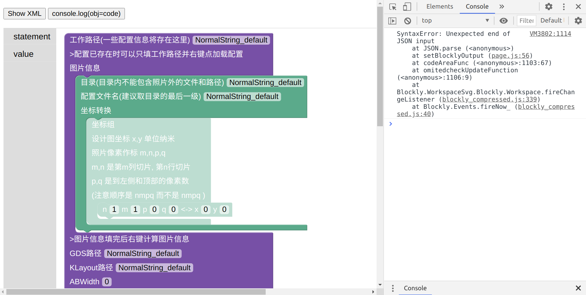
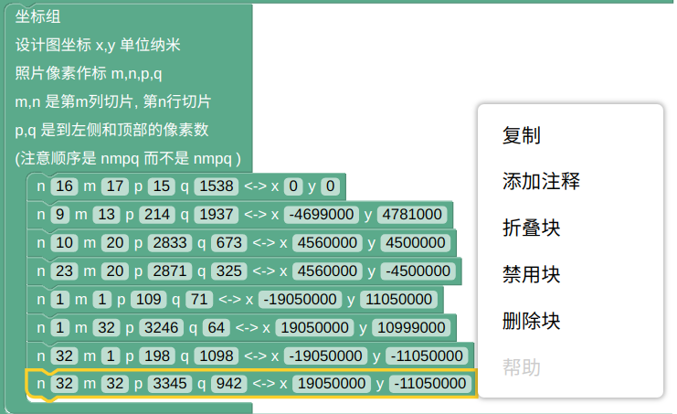
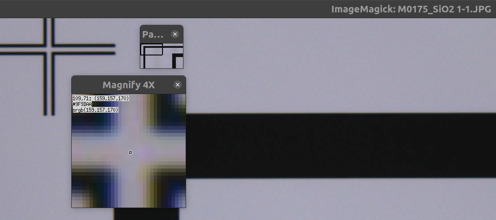
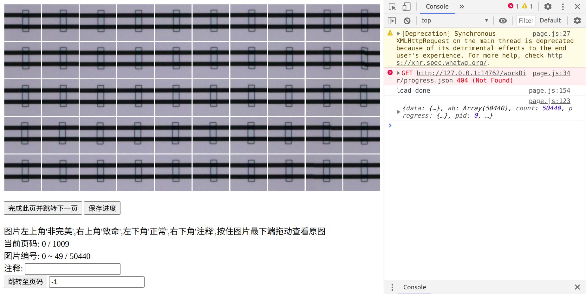

# 使用说明

双击 main_page.cmd  
此时会打开一个 http://127.0.0.1:14762/blockly.html 的chrome页面  
作为主界面 (使用chrome版本 >= 86 来保证主界面正常运行)

按 ctrl+shift+i 打开 开发者工具 (在开发者工具的标签页中切换到Console页)

点击左侧`statement`, 将第一个图块拖拽出来

此时的界面如图

按照图块的指示一步步进行
+ 创建一个文件夹, 把文件夹路径填在第一行
+ 填写显微镜照片的路径 和 配置文件名
+ 建立坐标转换
+ ...

注意填完工作路径后就可以使用右键的`保存配置`了

值得额外注意的流程在以下列出, 使用过程留意 开发者工具 的输出

## 坐标组

如何通过 _坐标组_ 来进行 _坐标转换_

建立好的坐标组如上图  

刷新浏览器可以使虚化的图块变为实体, 此时可以右键点复制来添加新坐标对.  
每个坐标对, 左侧是照片内坐标, 右侧是设计图坐标.  
在linux中使用ImageMagick来获取图片坐标如下示意图  
  
可以读出`1-1.JPG`中mark的`照片坐标`是109,71  
在windows中使用右键编辑, 借助画图工具倍数调到400%, 鼠标放在十字中心,  
左下角也会显示出这个坐标.  

## 提取AB信息

要先在设计图中把测试AB联通性之类的不在照片范围内的AB删除

## 人工检查AB

右键点击人工检查AB后, 按 ctrl+shift+i 打开开发者工具后, 会出现如图所示的界面

鼠标对图片的进行相应动作来做标记
+ 左上角'非完美'
+ 右上角'致命'
+ 左下角'正常'
+ 右下角'注释', 要先在坐下填好注释后才能点 (只允许字母数字和下滑线) 
+ 按住图片最下端拖动查看原图

正常的图不需要点'正常', 点 完成此页 时会把所有无色的标记为正常  

**点保存进度才会真正储存所做的标记**  

## 解决方案

会创建一个gds  

用klayout同时打开原图和生成的`solution.json`, 把解决方案内的图形框住,  
复制粘贴到原图, 检查完后利用klayout的减法功能完成编辑